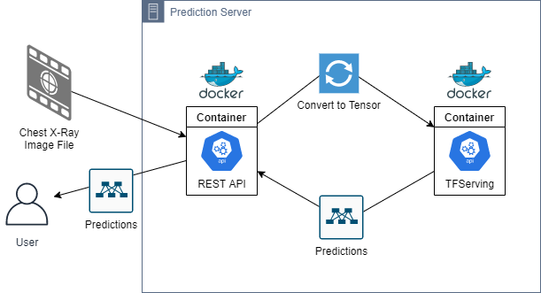
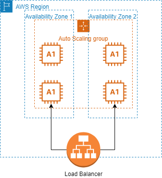
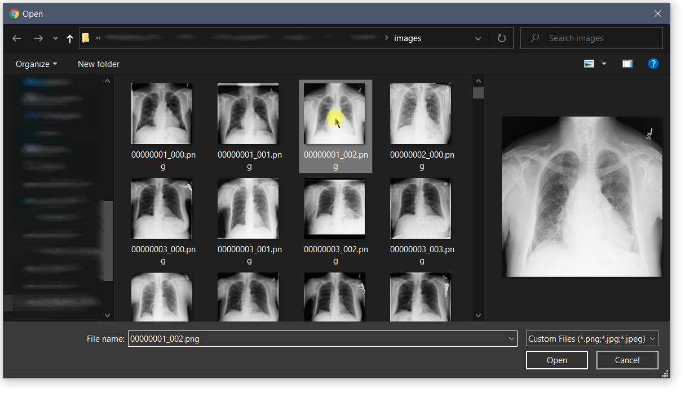
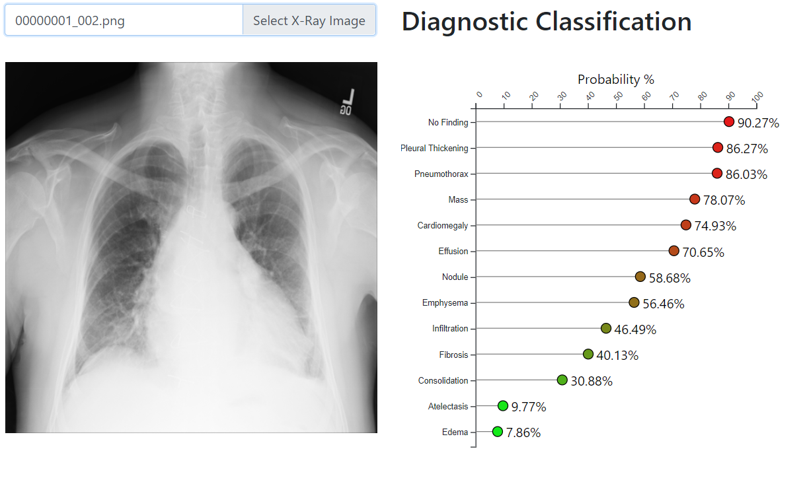

# Section A - Project Proposal/Recommendation

## Problem Summary
`COMPANY_NAME`is a medical imaging company that provides on-going or on-call as needed radiologic image readings for physicians and clinicians in various settings ranging from urgent care facilities to general practitioners and family medicine. Clinicians rely on fast and accurate diagnostic readings of a wide range of imaging techniques but chief among these are chest X-ray images. Chest X-ray imaging is inexpensive, fast, and has a low radiologic risk to patients and as such is often the first-line diagnostic tool for disease diagnosis and patient treatment planning.

As `COMPANY_NAME` expands, more and more facilities and practitioners are contracting the expertise of `COMPANY_NAME`'s expertise in providing results in a timely fashion. This influx of clientele has stretched the existing resources beyond their current capabilities. As such, `COMPANY_NAME` has expressed a desire to create a pilot program for automating the diagnostic process with chest X-ray imaging with machine learning models to assist the existing radiologist staff with improving the turn-around time for diagnostic results in this high volume service.

## Application Benefits
The proposed solution is to create a predictive model that can receive a chest X-ray image and determine the probabilities of specific diagnostic labels being applied to the image. With a sufficiently accurate model, an automated system can be created to provide immediate results rather than necessitating manual review that can take several minutes or hours. These results can then be forwarded to radiologists for confirmation of the findings and aid them in looking for specific diagnostic markers that indicate the specified findings. Additionally, this service can be provided to existing clients of `COMPANY_NAME` to provide immediate results in urgent care situations.

## Application Description
The application will be segmented into four distinct parts:

- A data pipeline that can receive new image batches and information to continually improve the existing model.
- A REST[^REST] API[^API] endpoint for submitting images for classification and returning classification probabilities.
- A frontend dashboard for exploring the training data and results of training sessions.
- A web-based interface for interacting with the aforementioned API in a rate-limited fashion allowing prospective end-users to demo the prediction model.

[^REST]: [Representational State Transfer](https://en.wikipedia.org/wiki/Representational_state_transfer)
[^API]: [Application Programming Interface](https://en.wikipedia.org/wiki/API)

## Data Description
The data [^nihDatasetCite] to be used for training and creating a model to assist radiologists and physicians in the diagnostic process has been collected by the National Institutes of Health data made public for data exploration and machine learning modeling. The data includes over 100,000 chest X-ray images collected from a little more than 30,000 unique individuals. Additionally, a comma-separated value file accompanies the data listing the diagnostic labels applied to each image as well as patient age and sex, view position, and image dimensions.

[^nihDatasetCite]: @nihDataset

The finding labels consist of 15 different potential labels, 14 of which indicate a cause for follow-up and 1 label indicating none of the 14 labels could be applied to the individual image. Each X-ray can be assigned any combination of these labels (excluding "No Finding" which is always a unique label for an image). The diagnostic labels include:

- Atelectasis
- Cardiomegaly
- Consolidation
- Edema
- Effusion
- Emphysema
- Fibrosis
- Hernia
- Infiltration
- Mass
- Nodule
- Pleural Thickening
- Pneumonia
- Pneumothorax

Further discussion regarding these data can be found in the [Data Analysis](#data-analysis) section.

## Objectives
Three broad objectives have been identified to designate this project as a success. The objectives are the following:

1. Create a predictive model with a minimum 90% accuracy rate on label classification for new chest X-ray images.
2. Deploy this model as a web application that can be utilized by `COMPANY_NAME` and contracted clients.
3. Provide prospective `COMPANY_NAME` clients with an informative dashboard that can discuss the model, model accuracy, and training process as promotional material for drawing in additional business.

## Hypothesis
Through the use of a KMeans Clustering model, Convolutional Neural Network, or a combination of both, a predictive model can be trained and generalized to provide an accurate diagnostic classification system per the objective listed above. This model will be able to be deployed as a standalone web service and receive new imaging data and return the predicted label classifications.

## Methodology
With the initial prototype development consisting of a single developer, the Sashimi Waterfall methodology will be used for the development process. Additionally, the requirements are well understood for this project making this development lifecycle a prime candidate for use during development. The overall development will be broken down into the following phases and executed in order, with feedback and fine-tuning of each stage as necessary:

1. __Requirements gathering and analysis.__ The requirements have been well defined throughout this document and are unlikely to change during development.
2. __Data collection.__ As discussed previously, data for training the application prediction model has been gathered and will be further analyzed during the lifecycle of the project.
3. __Data analysis.__ The data will be analyzed for outliers, suitability for training, trimmed down to manageable batches, and explored for best results. This analysis is discussed further in the [Data Analysis section](#data-analysis) section below.
4. __Model creation, training, and evaluation.__ A predictive machine learning model will be created, trained, and evaluated on a variety of metrics to determine suitability for deployment and use for generalizing to new data. This is an iterative process and will persist until either a suitable model is created or it is determined that a model cannot be created with the given data or constraints.
5. __Deployment.__ The model will be deployed to a cloud service provider as a web service API for use in predicting and generalizing to testing data not presented during the training phase.
6. __Web Application Development.__ The data collected during data analysis and model training will be collated and made presentable as a web application. This application will then be wired to the deployed predictive model for demonstration purposes.
7. __Maintenance.__ At this time, the application will enter the maintenance phase of development. The predictive model will be fully modular and can be replaced by a new model that has been trained on new data points. Different versions of the model will be maintained and version-controlled to allow for gradual roll-outs to improvements to the overall system. At this time, the project will be handed over to the client.

## Funding Requirements
Total funding for project development and implementation is estimated at \$9,920 with an ongoing, yearly maintenance cost of approximately \$4,800 to \$5,100 for maintaining the cloud server environment on which the component services will live. A full cost breakdown of these costs is provided in the [Resources and Costs](#resources-and-costs) section.

## Stakeholders Impact
The stakeholders for this project include `COMPANY_NAME` and their clients. The predictive model created will enable `COMPANY_NAME` to provide greater efficiency in evaluating chest X-ray images for diagnostic classification and can potentially be offered as an additional service to its clients that require immediate diagnostic classification of chest X-rays but do not require the full usage of services from `COMPANY_NAME` radiology specialists.

## Data Precautions
The data used to train the prediction model complies with all HIPAA regulations and contains no protected health information (PHI) or personally identifiable information (PII). The data has been issued a CC0 1.0 Universal License[^CC0] and dedicated to the public domain. Furthermore, any new data that is to be gathered and consumed by the resultant web service will consist only of chest X-ray images with no identification information and no images will be retained by the web service. Finally, TLS/SSL encryption protocols will be enacted to only allow communication with the web service via HTTPS protocols.

[^CC0]: See [CC0 1.0 Universal https://creativecommons.org/publicdomain/zero/1.0/legalcode](https://creativecommons.org/publicdomain/zero/1.0/legalcode) for the full information regarding this license.

## Developer Expertise
The developer has 8 years of experience in software engineering, specializing in web applications and web service deployments. Additionally, the developer has 3 years of experience in architecting artificial intelligence systems and machine learning models for predictive analysis. Consultation with regards to radiologic expertise will be made available by `COMPANY_NAME` as needed for understanding the data during development.

# Section B - Business Requirements and Technical Summary

## Problem Statement
Chest X-ray imaging is a very common, quick, and effective technique for diagnosing a wide variety of diseases related to the lungs and heart. The machines used for these scans can be easily deployed to a variety of settings including hospitals, small clinics and offices, and even disaster areas. However, the requirement for these scans to be read and interpreted by highly trained physicians limits the efficiency with which these scans can be utilized. Applying a machine learning methodology to analyze and predict probable diagnostic findings in a chest X-ray can save countless time, money, and resources to providing actionable diagnostic intelligence to physicians and clinicians in a matter of seconds. While some models do exist for binary classifications, such as a finding of pneumonia vs. no finding of pneumonia, no all-encompassing methodology exists for a multi-label classification problem.

## Customer Summary
`COMPANY_NAME` is an industry leader in medical imaging and interpretation. The company continues to grow at a record pace and is continually expanding its reach of off-site imaging systems and contracted image interpretation. As a result of this growth, `COMPANY_NAME` must keep pace with current technologies to continually improve and advance the medical imaging industry. With this in mind, `COMPANY_NAME` has decided to move forward with a prototype of a multi-label classification system for chest X-ray imaging.

It is the hope that this prototype project will yield actionable information with regards to further expanding automated diagnostic classification within other imaging techniques, such as Computed Tomography (CT), Magnetic Resonance Imaging (MRI), and other high precision scanning techniques. Should a model prove effective on X-ray imaging, a technique that has a significantly lower image and diagnostic precision overall than these more expensive scans, it is believed that this can be used to catapult `COMPANY_NAME` to significant advances in automated diagnostic medicine.

## System Analysis
This project is considered a pilot program for `COMPANY_NAME` and currently no infrastructure exists to support the development or deployment of the predictive model as a web service. Fortunately, the systems requirements for deployment are uncomplicated and can be easily provisioned in the cloud. Amazon Web Services has been selected as the cloud provider for this project as they provide the greatest number of resources for future scaling of the business needs for `COMPANY_NAME`.

The deployed web service will exist as two applications on a single server: a REST endpoint for receiving images and converting them to data that can be used by the prediction model and the prediction model itself. The forward endpoint will be served as a Flask[^Flask] RESTful service contained in a Docker image. This application will then communicate directly with the REST endpoint created by TensorFlow Serving[^TFServing] Docker container, receive the results, and then return them to the originating end-user. Both containers will be run in tandem using Docker Compose[^DockerCompose] on a single server.



The servers will be deployed in an auto-scaling group to maintain high availability of the application, with a network load balancer to direct traffic between the servers. Two instances will be online at all times with each living in a separate availability zone. During peak traffic, additional servers will be provisioned automatically to adjust for this increase in traffic. When traffic begins to taper out, these servers will be automatically terminated to save on costs.



[^Flask]: [https://flask.palletsprojects.com/en/1.1.x/](https://flask.palletsprojects.com/en/1.1.x/)
[^TFServing]: [https://www.tensorflow.org/tfx/serving/docker](https://www.tensorflow.org/tfx/serving/docker)
[^DockerCompose]: [https://docs.docker.com/compose/](https://docs.docker.com/compose/)

## Data Analysis
The data used for training the predictive model has been published for use on Kaggle.com and can be located at [https://www.kaggle.com/nih-chest-xrays/data](https://www.kaggle.com/nih-chest-xrays/data). It consists of 112,120 distinct chest X-ray images taken both posterior-to-anterior (PA) and anterior-to-posterior (AP). Accompanying the images are comma-separated value files containing image metadata, patient diagnostic findings, follow-up information, and non-identifying patient ID numbers.

This data will be analyzed for outliers, incomplete data, and otherwise unusable data. Any data that is determined to be unusable will be excluded from the overall process. Metadata will be reformatted and/or reshaped to provide ease of usability. Lastly, training a model on image data will require that images are converted to raw number values that can be fed into the model for training.

## Project Methodology
This project will use the Sashimi Waterfall methodology for project development. Requirements are well understood and discussed throughout this document in detail. These factors make this project a prime candidate for the Waterfall methodology of project development. However, as development continues to progress and constraints are identified, feedback may require revisiting previous stages of development. The adoption of the Sashimi variation of Waterfall is therefore prudent during the development of this project. Further discussion regarding the individual stages of development follow.

### Requirements Analysis
The full requirements of this document will be analyzed for accuracy and understanding prior to any development of the project. This document will be modified or appended as necessary during this stage of development.

### Systems Design
The full system will undergo a complete design of broad functionality and individual parts and their interactions will be identified. Some basic systems design has been undertaken to better understand the requirements and is illustrated in the [Systems Analysis](#systems-analysis) portion of this document. This model will undergo refinement during the following phase as necessary.

### Coding and Implementation
This phase of development will be broken down into three distinct pieces, each contingent on the previous. During this phase, each individual piece will be evaluated and tested independent of the full project. Unit testing will be conducted at a granular level of each component.

#### Data Analysis
A complete understanding of the given data will be performed. During this time, any augmentation, additional collection, trimming of outliers, and collating into manageable chunks will result in visualizations for use describing the data. This is key to creating the predictive model.

#### Predictive Modeling
The keystone of the overall application, the predictive model, will be created, tested, and evaluated. As this is the most important part of the project, the majority of development time spent will be during this phase.

#### API Development
The completed (or prototypical) predictive model will be containerized. Following this, the middleware server API will be created to allow interaction with the predictive model.

#### Front-end Application Development
A front-end, single-page web application will be created, built, and deployed to cloud storage for demonstrating the predictive model to prospective clients and further evaluation.

### Systems Testing
Upon completion of each individual item above, the full environment will be evaluated for accuracy and integration.

### Deployment to Cloud Environment
Upon successful integration testing of the environment, the full project will be deployed to a prototyping cloud environment that will mirror the final specifications of the overall environment. During this time, further integration testing and acceptance testing will be undertaken. Should acceptance testing result in a successful outcome, the environment will be moved to a full production environment and transitioned to maintenance.

### Maintenance
The full project will undergo routine health checks, monitored via log output to AWS CloudWatch[^cloudWatchCite]. These logs will monitor individual server health metrics and activity. A full maintenance pipeline will be created to allow retraining and deployment of the predictive model to the production environment.

[^cloudWatchCite]: [https://aws.amazon.com/cloudwatch/](https://aws.amazon.com/cloudwatch/)

## Project Deliverables
Project success is dependent on the following deliverables:
- Python script for instantiating, training, and saving a predictive model.
- Dockerfile for building a trained and saved model within a Docker container.
- Python Flask middleware server script for converting image data and interacting with the aforementioned container.
- Dockerfile for building the middleware server within a Docker container.
- Docker Compose file for initiating and linking these containers.
- Source code for the front-end, single-page web application build with the React.js[^reactCite] and Gatsby.js[^gatsbyCite] Javascript framework libraries.
- A complete analysis of the data used for training, as well as the results of the trained model.
- A zip file containing the subset of images used for training, validation, and testing.

[^reactCite]: [https://reactjs.org/](https://reactjs.org/)
[^gatsbyCite]: [https://www.gatsbyjs.com/](https://www.gatsbyjs.com/)

In addition to the above, the project will undergo full version-controlling using Git during development. This repository will be made available at [https://github.com/scgerkin/C964_Capstone](https://github.com/scgerkin/C964_Capstone).

## Implementation Plan
The implementation plan for creating the predictive model and deploying it as a consumable API will follow these steps:

1. Data will be collected and collated for training the model. This will include a selection of chest X-ray images of similar dimensions and quality. The images will consist of a wide-range of diagnostic labels.
2. The data will be explored and cleaned for outliers, unusable scans, and otherwise invalid data.
3. A random sampling of each diagnostic label will be collated. Initial plans are to have an equal number of samples per label with a minimum number of 500 scans per diagnostic label. A portion of this data will be withheld for validation and testing purposes.
4. The images will undergo standardization and normalization before being fed into machine learning models.
5. KMeans clustering will be explored as a method for dimensionality reduction. Should this prove effective, it will be used to streamline the predictive model and provide less complex training data.
6. A basic convolutional neural net[^handsonMLCite] (InceptionV3[^inceptionv3Cite]) will be fed the training data and evaluated for diagnostic accuracy.
7. The trained model will be containerized using Docker and deployed to AWS EC2[^ec2Cite].
8. A Flask REST middleware will be created for interacting with the aforementioned model and deployed alongside in a separate Docker container.
9. A front-end, single-page application will be built using React.js and Gatsby.js to interact with the backend API.
10. Data visualization regarding the training, validation, and testing data will be incorporated with the aforementioned application.
11. The application will be compiled and deployed to Amazon S3[^s3Cite] for hosting.
12. The full application will undergo acceptance testing and modification as needed.
13. Ongoing maintenance and model updates will be performed as needed.

[^handsonMLCite]: @handsonML pp. 447-478
[^inceptionv3Cite]: TensorFlow InceptionV3 will be used for this application [for the documentation see @inceptionV3]
[^ec2Cite]: [https://aws.amazon.com/ec2/](https://aws.amazon.com/ec2/)
[^s3Cite]: [https://aws.amazon.com/s3/](https://aws.amazon.com/s3/)

## Evaluation Plan
The application will be evaluated and verified for acceptance in a combination of methods.

- The prediction model will be evaluated for classification accuracy from validation and testing data that has been separated from all training. This evaluation will involve plotting the confusion values of true-positive rates vs the false-positive rates for individual diagnostic labels.
- The REST API will be tested and monitored for load by issuing expected traffic requests to the API. The results of these tests will be used to adjust the server instance, auto-scaling settings, and resiliency of the API.
- The front-end application will undergo end-user acceptance testing to validate the application meets the specifications and requirements created by `COMPANY_NAME` for usability.

## Resources and Costs

### Programming Environment
The following environments are to be used for the development and deployment of the final project. This is not meant to be a complete list and a full environment list will be available in the final source code. All tools listed below are open-source software. Licensing fees may apply, but are the responsibility of `COMPANY_NAME`.
- Python 3.7.9
- Anaconda 4.9.1
- Docker 19.03.13
- Node.js 12.16.3

### Environment Costs
Each instance of the full server application will reside on an AWS EC2 a1.xlarge instance. On-demand pricing in the US-EAST1 region is \$0.102 per hour. 2 servers are to be online at all times to maintain availability, costing a total of \$1787.04 per year. This can be discounted by 60% by purchasing reserved instances for these servers, bringing the yearly cost for both servers down to \$714.82. Additional costs will be incurred for additional on-demand servers during peak traffic hours. This is expected to be an average of 30 hours per week, adding \$160 to \$480 per year.

This makes the combined environment cost for maintenance approximately \$2,000 to $2,300 per year.

### Human Resource Requirements
Total upfront development for the project is estimated at 4 weeks at 40 hours per week. The contracted cost of the project developer is \$62/hr. This comes to a total of \$9,920 total cost for development.

Ongoing maintenance of the project is expected to take an average of 1 hour per week, assuming no additional development is required. This cost is prorated to \$55/hr, totaling \$2,860/yr.

## Timeline and Milestones
| Phase                       | Start      | Complete   | Duration |
|-----------------------------|------------|------------|----------|
| Requirements Analysis       | 11/01/2020 | 11/04/2020 | 3 Days   |
| Data Collection             | 11/5/2020  | 11/7/2020  | 2 Days   |
| Data Analysis               | 11/7/2020  | 11/11/2020 | 4 Days   |
| Model Creation              | 11/12/2020 | 11/26/2020 | 14 Days  |
| Deployment                  | 11/27/2020 | 12/4/2020  | 7 Days   |
| Web Application Development | 12/5/2020  | 12/19/2020 | 14 Days  |
| Testing                     | 12/20/2020 | 12/30/2020 | 10 Days  |
| Maintenance                 | 1/1/2021   |  -         | Ongoing  |

# Section C - Application Design and Development

## Data Methodologies

### Descriptive (KMeans Clustering)
KMeans clustering[^miniBatchNote] was explored as a means of dimensionality reduction for the training data before processing by the neural net. Using the training data selected to be fed into the neural net, the appropriate number of clusters was assumed to be 13 (the number of classification labels present on the trimmed data). However, this assumption was tested by testing a range of clusters from 2 to 100 and the respective inertias and silhouette scores for each model created for these clusters were analyzed.

[^miniBatchNote]: To speed up training analysis, MiniBatchKMeans was used. This method of KMeans shows significantly faster training with little to no difference in model accuracy compared to traditional methods [see @handsonML pp 224-245]

The following code snippet[^kmeansFile] was used for evaluating the number of clusters:

```python
models = []
inertias = []
scores = []

for k in range(2, 101):
    print(f"Creating KMeans for {k} clusters")
    kmeans = MiniBatchKMeans(n_clusters=k, random_state=RND_SEED).fit(imgs)
    models.append(kmeans)
    score = silhouette_score(imgs, kmeans.labels_)
    scores.append(score)
    inertias.append(kmeans.inertia_)
    pickle_model(kmeans, k, score)
```

[^kmeansFile]: The complete source code for this can be found at `ml/training/cluster-determination.py`.

The results of this modeling and the validity of KMeans for dimensionality reduction is discussed in the [Accuracy Analysis](#accuracy-analysis) section.

### Predictive (Neural Net)
A convolutional neural net (CNN), more specifically InceptionV3[^inceptionV3paperCite], was used for image classification and prediction. Inception, sometimes referred to as GoogLeNet[^googleNetCite], is a CNN created by Google and trained on the ImageNet database. It shows a significant accuracy rate on this database and has been used in several computer vision problems since. As such, it was selected to provide the predictive model for this application. The model used for this application was given the pre-trained weights created with ImageNet to potentially show greater accuracy in the overall model and provide a reasonable training time.

[^inceptionV3paperCite]: @inceptionv3paper
[^googleNetCite]: @handsonML pp 466-467

The following code snippet[^dxInceptionFile] shows how the model was instantiated, compiled, and trained for use in the application:

```python
def init_model():
    base = Sequential()
    base.add(InceptionV3(input_shape=train_gen.image_shape,
                         include_top=False,
                         weights="imagenet"))
    base.add(GlobalAveragePooling2D())
    base.add(Dense(512))
    base.add(Dense(len(sample_labels), activation='sigmoid'))
    optimizer = tf.keras.optimizers.Nadam(learning_rate=0.001)
    base.compile(optimizer=optimizer,
                 loss="categorical_crossentropy",
                 metrics=["accuracy", "mae"])
    return base


model = init_model()
num_epochs = 100
model_name = "dx-weighted-inception"
model = train_checkpoint_save(model, train_gen, valid_gen,
                              model_name, num_epochs=num_epochs, version="00")
```

The training information and accuracy analysis are discussed in the [Accuracy Analysis](#accuracy-analysis) section.

[^dxInceptionFile]: The complete source code for this can be found at `ml/training/dx-weighted-inception.py`.

## Datasets Discussion
As noted in the paper[^nihPaperCitation] about the data, provided by the NIH, the diagnostic findings for each image are gathered by an NLP program, parsing from the original radiology reports. Unfortunately, these reports are not available, and there are some noted errors found in some of the diagnostic labels, as referenced in the provided table from the paper. A selection of these scans has been reviewed for accuracy by a third party radiologist[^Oakden-RaynerCite] and his findings indicate the labels may have significant accuracies, although he notes that the original diagnostic labels by the originating radiologists most likely had additional clinical information to assist them in determining a diagnosis.

[^nihPaperCitation]: @nihPaper
[^Oakden-RaynerCite]: @oakdenRayner

Unfortunately, without a complete review of each scan by a trained radiologist, it is not possible to limit the data used for training the predictive model to only use particularly indicative images. This may lead to difficulty in creating a sufficiently accurate predictive model and, even if one should be created, it is unlikely that the resultant model is likely to generalize well to new information. However, at this time no additional data has been provided by `COMPANY_NAME` for creating a predictive model, and as such, best efforts will be made given these constraints with the ability to retrain the model on new or improved data when it is available.

Lastly, the metadata about each image possibly contains several errors in reporting. For instance, the "age" column for images range from 1 to 414 with no associated units. As such, it is impossible to use this information for any significant information when analyzing or using for predictive modeling. The assumption has been made that this column is meant to indicate years. As such, any image with an age of greater than or equal to 100 has been trimmed from the prospective data.

## Analytics and Decision Making
The application has the ability to assist clinicians in the diagnosis of patients via chest X-ray. As a demonstration of the ability, the web application can be used to interact with the prediction API with a few simple clicks. The results of the analysis give probabilistic classification labels and are displayed to the end-user. A demonstration of this in action can be viewed in the [Real-Time Query](#real-time-query) section below.

## Data Cleaning
As discussed previously regarding the age column of the data, results with an age greater than or equal to 100 have been removed. The methodology behind this and the results is demonstrated with the following code snippets, using the Pandas[^pandasCite] data analysis tool for Python:

[^pandasCite]: [https://pandas.pydata.org/](https://pandas.pydata.org/)

```python
import pandas as pd
df = pandas.read_csv("..")
df["Patient Age"].describe()
```
```
count    112120.000000
mean         46.901463
std          16.839923
min           1.000000
25%          35.000000
50%          49.000000
75%          59.000000
max         414.000000
```
```python
df["Patient Age"][df["Patient Age"] < 100].describe()
```
```
count    112104.000000
mean         46.872574
std          16.598152
min           1.000000
25%          35.000000
50%          49.000000
75%          59.000000
max          95.000000
```

Additional modifications to the image metadata file have been made to allow for easier use with analysis and modeling. This includes normalizing the column names to remove spaces, splitting the diagnostic findings by label and creating a one-hot encoded array for each image, and removing additionally identified unusable images (either from poor image quality, sizing constraints, or others) in the `cxr14_bad_labels.csv` file.

The following code snippet illustrates a broad overview of how data cleaning was accomplished[^cleanDataFileLoc]. After cleaning, the resultant DataFrame was saved to a new CSV for future usage.
```python
img_metadata = pd.read_csv(img_metadata_loc)
img_metadata.rename(columns={
    "Image Index"   : "img_filename",
    "Patient ID"    : "pt_id",
    "Patient Age"   : "pt_age",
    "Patient Gender": "pt_sex",
    "View Position" : "view_position",
    "Image Width"   : "img_width",
    "Image Height"  : "img_height",
    "Spacing X"     : "x_spacing",
    "Spacing Y"     : "y_spacing"}, inplace=True)
unusable_imgs = pd.read_csv(unusable_img_loc)
finding_labels = get_finding_labels(img_metadata)
save_labels_to_csv(finding_labels)
img_metadata = remap_labels(img_metadata, finding_labels)
img_metadata = drop_known_unusable(img_metadata, unusable_imgs)
save_usable_to_csv(img_metadata)
```

[^cleanDataFileLoc]: The full code for this cleaning can be found in `ml/training/clean-data.py`.

## Data Visualization
//TODO You need at least three real-time (e.g. using the GUI/dashboard) formats to visualize the data in a graphic format. Look at things like charting, mapping, color theory,plots, diagrams, or other methods(tables must include heat mapping). These,in conjunction with or as a part of your GUI,would enable users to explore or inspect the data characteristics

## Real-Time Query
The front-end application allows a user to upload a chest X-ray image directly to the prediction model through their browser with a simple form element:


Clicking on this form element will bring up a File Selector:


During analysis, the original image will be displayed on-screen. Once the analysis is complete, a graph will display the indicated classification probabilities:


This portion of the web application functionality can be accessed at `//TODO: X-RAY_ANALYSIS_URL`.

## Adaptive Element
The included scripts and code for the prediction model have been included. These items can be used to create a data pipeline for continual improvement and adaptation to new information. Additionally, the simplicity of use inherent with TensorFlow/Serving as a means of serving the model as a REST API allows for versioning the system. The container for the model only needs to be rebuilt with updated training weights for the model and phased into the existing server architecture. This allows a seamless transition of models that can be deployed or rolled back as new models are trained and evaluated.

## Outcome Accuracy
The model will be evaluated on several metrics during the iterative training sessions, or epochs. Categorical cross-entropy[^cceCite] will be used as the main loss function and targeted for improvement by the neural net during training. This measures the model on its ability overall to classify the input for a multi-label classification problem. A lower score for this metric indicates a better model. Additional metrics will also be collected during training, including overall model accuracy, and mean absolute error. However, it should be noted that with a multi-label classification problem, while attempting to determine the probabilities of classification, accuracy is not necessarily a metric generally indicative of individual label classification accuracy. As such, upon a full training session of the model, it will be evaluated on a per-label basis to measure the true-positive rate (the sensitivity of classification) against the false-positive rate (the specificity of classification) the Receiver Operating Characteristic (ROC Curve)[^rocCurveCite]. This will then be plotted and analyzed for the Area Under the Curve (AUC) to determine the viability of each label classification.

[^cceCite]: For more information about this, see @understandingCCE
[^rocCurveCite]: For more information about this, see @rocCurve

## Security Measures
It is a simple fact that any information that is not stored is not subject to a breach of confidentiality via intrusion or compromise of data stores. To whit, and in compliance with HIPAA and to protect patient health information, the application is built to require as little information as possible, and absolutely no information is persisted following communication. As the only input that is necessary to feed into the model and receive a prediction is an X-ray image, it is the responsibility of the end-user to verify that these images do not contain any protected information. However, as a routine matter of course and to protect information from interception, the application communication channels are to be encrypted with modern TLS standards that include HTTPS protocols to maintain secure message passing.

## Product Health Monitoring
The health of the servers can be monitored and automated using AWS CloudWatch logs. These logs can provide specific server metrics over 5-minute intervals including average CPU and RAM usage which can be used to validate the servers are not overloaded with too many network requests. The architecture of the auto-scaling group is meant to be self-correcting and will automatically terminate unhealthy servers and replace them with new servers.

With regards to the prediction accuracy, this will have to be monitored separately from the application. The application does not save any image, prediction, or any other information locally or externally. Evaluations should be performed routinely by feeding images with known classification labels to receive predictions on this data. This can then be compared to the ground-truth of these images to evaluate the model on an ongoing basis. These images and labels can additionally be used in the future to provide ongoing training to the model.

## Dashboard
//TODO include a user-friendly, functional dashboard that enables the query and display of the data,as well as other functionality described in this section. This could be stand-alone, Web-based, or a mobile application interface

# Section D - Implementation Review Analysis

## Project Purpose
The purpose of this project is three-fold:

1. To take given data containing chest X-ray images and diagnostic labels regarding those images and create a dashboard for exploring the data.
2. To create a predictive classification model for determining the diagnostic labels for images new to the model and evaluate the model for efficacy and accuracy.
3. To deploy the model as a RESTful service for consumption by `COMPANY_NAME` and its contracted clients.

Each point of the project was solved separately but combined to create the overall product. The first and third objectives were able to be met satisfactorily and can be explored at `APPLICATION_URL` for verification.

Unfortunately, while it was possible to create a _working_ model for the second objective, the accuracy of the model created was not able to meet the standards set by `COMPANY_NAME` to be considered an effective aid for automated diagnosis at this time. A full review of the model, datasets and issues within, and conclusions regarding the prediction model can be found in the following sections.

## Datasets
Machine learning models require numerical data for analysis and prediction. Therefore, all images used for training, validation, testing, or otherwise must be converted to a numerical format to be fed into the models. This was accomplished using an image preprocessor from Keras, `ImageDataGenerator`[^idgCite]. This automatically reads in data in batches (or individually), converts the images to numerical arrays of 0 to 255 per each image channel (RGB), and can be used for normalization and standardization.

[^idgCite]: For the documentation regarding this API see [https://www.tensorflow.org/api_docs/python/tf/keras/preprocessing/image/ImageDataGenerator](https://www.tensorflow.org/api_docs/python/tf/keras/preprocessing/image/ImageDataGenerator).

The code for initializing the `ImageDataGenerator` follows:
```python
def init_image_data_generator(split=False):
    split_value = SPLIT_VALUE if split else 0.0
    return ImageDataGenerator(
            samplewise_center=True,
            samplewise_std_normalization=True,
            fill_mode='constant',
            cval=1.0,
            validation_split=split_value)
```

The original dataset includes a significant amount of images. As the data fed into a model increases, so does the training time. Initial attempts to use the entire dataset resulted in epoch training times of well over 15 minutes each, leading a full training session of 100 epochs to effectively require over 10 hours of training time. As this was impractical for prototyping purposes, the dataset was trimmed to include only 500 images of single-label images. Using this threshold additionally limited the number of classification labels from 15 to 13 as not all single-label classifications had at least that many samples.

The trimming of the data was accomplished using the following code (`#...` indicates truncation of uninteresting code or code used for sanity checks)[^trimDataCite]:
```python
# Load only records with a single finding
img_metadata = get_img_metadata()
single_finding_records = img_metadata[
    img_metadata["findings_list"].apply(lambda val: len(val) == 1)]

df = single_finding_records
dx_labels = get_dx_labels()

#...

SAMPLE_THRESHOLD = 500
# Remove any records with a finding below the threshold
# also remove the column for that label
removed_labels = set()
for label, count in pre_drop_counts.items():
    if count < SAMPLE_THRESHOLD:
        indices = df[df[label] > 0.5].index
        df = df.drop(indices)
        df = df.drop(labels=[label], axis=1)
        removed_labels.add(label)

#...

# Get equal number of samples of each finding label
RANDOM_SEED = 42

target = pd.DataFrame()
sample_counts = {}
for label in sample_labels:
    sample = df[df[label] > 0.5].sample(n=SAMPLE_THRESHOLD,
                                        replace=False,
                                        random_state=RANDOM_SEED,
                                        axis=0)
    sample_counts[label] = len(sample.index)
    target = pd.concat([target, sample])

# Shuffle the dataset
target = target.sample(frac=1, random_state=RANDOM_SEED)
```

[^trimDataCite]: The full source code for this can be found at `ml/training/dx-weighted-inception.py`.

This DataFrame was then used for creating the data batches used for training the model, allowing for a much more manageable dataset during training and reducing each epoch training time to 1 to 2 minutes. This trimming of data theoretically does not contribute to the overall accuracy of the model, as will be discussed further in the [Accuracy Analysis](#accuracy-analysis) section. While increasing the size of the dataset can increase overall accuracy, other factors were likely at play with regards to the validation accuracy failing to improve over time.

Once the target DataFrame was created, this was fed into the `ImageDataGenerator` to create the data batches. This was accomplished with a few functions, as follows:

```python
IMG_SIZE = 256
BATCH_SIZE = 32

def get_train_valid_test_split(img_data):
    train_df, test_df = train_test_split(img_data, test_size=0.10,
                                         random_state=42)

    training_data = get_data_batch(train_df, subset="training")
    validation_data = get_data_batch(train_df, subset="validation")
    test_gen = get_data_batch(test_df, subset=None)
    return training_data, validation_data, test_gen


def get_data_batch(img_metadata,
                   batch_size=None,
                   rnd_seed=None,
                   subset=None):
    if batch_size is None:
        batch_size = BATCH_SIZE

    valid_subset = subset == "training" or subset == "validation"
    if subset is not None and not valid_subset:
        raise ValueError(f"Invalid subset value: {subset}")

    shuffle = subset == "training"

    idg = init_image_data_generator(split=valid_subset)

    return idg.flow_from_dataframe(img_metadata,
                                   directory=str(PurePath(IMG_DIR)),
                                   x_col="img_filename",
                                   y_col=Y_COL_NAME,
                                   target_size=(IMG_SIZE, IMG_SIZE),
                                   color_mode="rgb",
                                   class_mode="categorical",
                                   batch_size=batch_size,
                                   shuffle=shuffle,
                                   seed=rnd_seed,
                                   subset=subset)

#...

train_gen, valid_gen, test_gen = get_train_valid_test_split(target)
```

In the functions above, the DataFrame is split into training, validation, and testing subsets for training and evaluating the neural net. Despite the images being grayscale, the images are converted to a faux-RGB by copying the single color channel across all color channels. This was to allow the model to use the pre-trained weights of ImageNet without major modification to the underlying model. Again, this likely did not contribute to the inaccuracy of the model, but instead likely increased the training time of the model with duplicated data. This trade-off was evaluated against having to reconstruct all weights from an initial state and increase the number of training epochs required by a significant amount. It was determined that this trade-off decreased overall training time as a result.

Lastly, each image was resized from the original 1024x1024 down to 256x256 to fit with InceptionV3 (and to decrease the training time).

## Data Product Code
//TODO review the functionality of the code used to perform the analysis of the data and how it provided the necessary functionality of descriptive and predictive outputs. You will also need to submit the entire, functional source code.

## Hypothesis Verification
The initial hypothesis, that a predictive model to classify chest X-ray images with diagnostic labels, could be created is tentatively accepted. Despite the fact that the created model was unable to reach an appropriate level of accuracy on validation and testing data, the model did show the ability to have a high degree of accuracy during training. This is indicative of data _overfitting_, or a propensity to accurately predict on the training data with failure to generalize to new, unknown data[^overfitCite].

[^overfitCite]: @handsonML p. 27

//TODO Add graph of training vs validation loss/accuracy

This can be mitigated in future iterations of the project with a variety of methods, such as longer training sessions or increasing the dataset, but were unable to be explored due to the time constraints of this project. However, it should be noted that, with the model successfully deployed within a simple Docker container, future iterations of training and prediction will be trivial to implement due to the modular design of the application overall.

## Visualizations and Reporting
//TODO provide a description of how your visualizations and elements effectively told an accurate story about the data. This needs to include items such as how your application supported data preparation, data analysis, and data summary. It should also include how your display techniques clearly explained any phenomenon detection if appropriate

## Accuracy Analysis
//TODO assess how accurate your application is at presenting the data and providing predictive outcomes. Provide an example of what the data showed and explain why those offer representative artifacts of the application’s accuracy

## Application Testing
Throughout development, the application was tested at a modular level manually. The REST API was tested using Postman[^postmanCite] to validate that the API could receive image POST requests and return an expected JSON response to be utilized by the end-user. This testing involved a very simple, happy path testing and was not exhaustive by any means. Similarly, the front-end application was tested manually throughout development. Due to the overall simplicity of the project, extensive unit testing was determined to be counter-productive to the overall creation of a prototype project. Once all components were successfully created and deployed, manual testing was again utilized to verify each component could integrate successfully and provide a functioning application.

[^postmanCite]: [https://www.postman.com/](https://www.postman.com/)

## Application Files
//TODO provide a comprehensive inventory of the files required to execute your application. Include a clear description of the interdependencies and file hierarchy. Describe how those files will be organized for submission. Include those files in the submission

## User's Guide
//TODO include a brief manual concerning the installation and use of your application. Be sure to describe all steps necessary to establish an environment capable of running your application. Provide clear, concise steps of how a user would execute the application and produce the results you’ve described in your documentation. Carefully consider and describe the procedural aspect of the application including know areas where certain crucial steps can affect the performance of the application. You must ensure that anybody can run the application. Please include details on the technology context that is required for your application to properly execute

## Summation of Learning Experience
Before starting the capstone, I had no experience with data science or machine learning. This required a very fast education in a variety of subjects and libraries, from the basics of how machine learning is implemented to individual Python libraries such as NumPy and Pandas. This learning was accomplished from a variety of mediums, including a Udemy course[^udemyCite], the _Hands-on Machine Learning_[^handsonCite] book and associated resources, and a vast swath of blog posts, documentation, and other resources gathered via Google searches. My previous experience learning programming and learning what to search for proved invaluable in finding these resources and providing a framework for understanding how to implement the requirements of this project. Lastly, I learned that machine learning is not as easy as it might appear from the amazing amount of abstraction provided by the various Python libraries. Although these libraries have been designed for ease of use, an understanding of how they work is very much a requirement for creating a working model. In retrospect, I should have found a subject matter much simpler than computer vision for my brief foray into this subject.

[^udemyCite]: @ztmML
[^handsonCite]: @handsonML

# References
